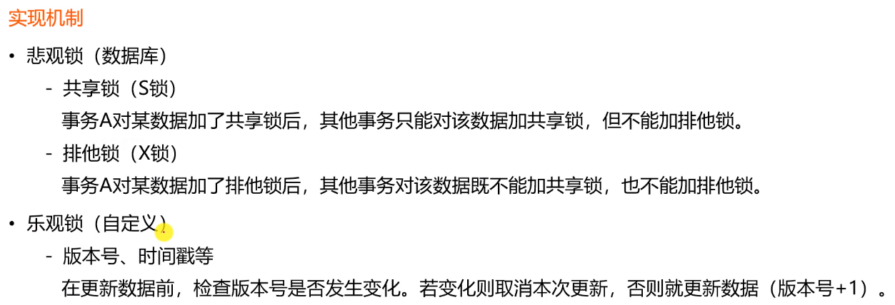

# Readme

Tis:
import 库的时候注意很多重名的库，看清楚namespace

## 基础功能
### 开发社区首页

操作数据表为user和discusspost，两者通过userid连接

创建entity，mapper（dao），service来实现对数据库的操作

最后使用分页功能，实现上下页和按指定页数跳转的功能（浏览器中的显示功能需要到index.html中进行一定的修改）

这个header在将来会在各种网页中复用：th:replace="index::header

Thymeleaf中href与 th:href的区别:
https://blog.csdn.net/hy1255564202/article/details/104199781

### git功能同步
一开始只使用中央服务器统一保管，容易丢失

git采用分布式版本控制，本地仓库和远程仓库

IDEA使用Git实现同步

### 开发登录功能模块
#### 发送邮件

注意，使用真实邮箱的时候需要注意授权问题，在设置里面打开，而且有可能需要将配置文件中的password设置为邮箱的验证码

使用工具类MailClient

#### 注册功能

CommunityUtil实现加密功能
注册功能在LoginController中实现

#### 会话管理

Http是无状态的，两次请求之间没有关系，使用cookies创建有状态的会话

Cookie由服务器创建发送到浏览器并且保存在浏览器本地，浏览器发送请求时携带发送到服务器上。Cookie只能存字符串类的相应数据，但是session啥都能存

Cookie一方面不安全，另一方面会占用资源。对应的解决方法就是Session（比如存密码），但是占用服务器资源

总结来说，一般用cookie，分布式部署session用的比较少

分布式中，无论是黏性session，还是同步session还是共享session,甚至Redis数据库存储session都存在问题，与分布式解决性能瓶颈的初衷有些违背

#### 生成验证码

验证码有现成的Kaptcha工具，wikis里面有how to use
因为是github的依赖，springboot没有做相应的配置，需要自己配置KaptchaConfig（实例化Producer接口）。然后在LoginController中添加验证码功能，在login.html中添加对应位置
这边需要在login.html页面修改验证码相关的信息（验证码路径已经刷新验证码）

#### 登录退出功能

CREATE TABLE `login_ticket` (
`id` INT(11) NOT NULL AUTO_INCREMENT,
`user_id` INT(11) NOT NULL,
`ticket` VARCHAR(45) NOT NULL,
`status` INT(11) DEFAULT '0' COMMENT '0-有效; 1-无效;',
`expired` TIMESTAMP NOT NULL,
PRIMARY KEY (`id`),
KEY `index_ticket` (ticket(20))
) ENGINE=INNODB DEFAULT CHARSET=utf8;

login_ticket这张表来存储用户的登录凭证

LoginTicketMapper中用注解的方式操作数据库,eg:    

@Insert({
"insert into login_ticket(user_id,ticket,status,expired) ",
"values(#{userId}, #{ticket}, #{statis}, #{expired})"
})//用逗号分开自动拼接，注意留出一个空格
@Options(useGeneratedKeys = true, keyProperty = "id")
public int methid(){}

这边mapper的注释实现也支持script(注意双引号需要转义)

在html文件中要显示默认值（例如账号密码）可以用request自带的功能，比如：
th:value="${param.username}"，这句话value的意思相当于request.getParameter(username)

网页里面动态判断：

<input type="text" th:class="|form-control ${usernameMsg!=null?'is-invalid':''}|"
th:value="${param.username}"
id="username" name="username" placeholder="请输入您的账号!" required>

该账号不存在!

userservice和logincontroller里面实现login和logout

#### 显示登录信息

拦截器也算表现层controller，在controller下面新建package：interceptor

拦截器除了Component注解，还要implements HandlerInterceptor，里面一共就三个拦截方法,同时配置类WebMvcConfig

配置 LoginTicketiterceptor

因为服务器对浏览器是一对多，每次创建一个新的线程来解决请求（多线程环境考虑隔离，用TreadLocal工具（以线程为key存取值））,针对这个问题编写工具类HostHolder

注意在WebMvcConfig添加拦截器的时候选择拦截的路径

#### 账号设置

在UserController中实现对个人主页中账号设置的功能，注意用户操作不到服务器路径，需要提供用户层面的访问。
用户上传用upload，但是更新用户头像需要get方法更新user的数据库

#### 检查登录状态
目的：防止用户直接通过访问url路径来访问本来不应该到达的地址，要让未登录的用户无法访问某些资源

* @Target声明自定义的注解作用的范围
* @Retention声明自定义注解的有效时间（编译还是运行）
* @Document声明自定义注解在生成文档的时候是否要带上
* @Inherited用于继承父类的注解

一般前两个一定要用，读取注解利用反射特性，在annotation.LoginRequired中实现（这是一个注解类）

目前加到了setting和upload对应的方法中，同时编写拦截器处理判断LoginRequiredInterceptor

Tips：拦截器中，这个类是有接口声明的，不能像controller直接return一个地址，需要重定向（controller的底层也是重定向）

### 开发社区核心功能

#### 过滤敏感词

敏感词前缀树构造示意图：

创建工具类ContextConfiguration，利用前缀树保存敏感词，同时过滤特殊符号。在sensitive-words.txt中保存要过滤的敏感词

#### 发布帖子
需要用到异步请求,看一下js文件的写法

引入fastjson包，在CommunityUtil下增加json对应的功能,用ajax-demo.html实现提交的功能，证明可以得到json数据

在数据层增加addpost的方法，在service层DiscussPostService实现上级方法，中间使用HtmlUtils和过滤敏感词,DiscussPostController设置访问路径和调用，在index.js中设置异步刷新

#### 帖子详情

主要增加根据id查询帖子的功能，细节注意显示作者的名字而非id

#### 事务管理

Spring一套API管理所有数据库的事务

测试方法卸载Userservice中，两个save方法表示两种方式，均支持回滚，建议使用第一种

#### 显示评论

comment这张表用来存储评论
status = 0表示评论有效，entity_type表示回复的类型，entity_id表示回复的具体id，target_id表示回复哪个user

创建对应的entity，dao，service，在DiscussPostController中修改逻辑

index.html和discuss-detail.html修改

#### 添加评论

对Comment和DiscussPost的三层进行修改，注意插入评论之后总的回帖数需要修改，核心代码是CommentService中addComment方法

评论文本除了敏感词过滤，还可以可做一个html语法的过滤，保持标签HtmlUtils.htmlEscape

创建CommentController实现回帖的跳转，添加评论之后需要回到当前post页面，所以controller路径设置成"/add/{discussPostId}"

